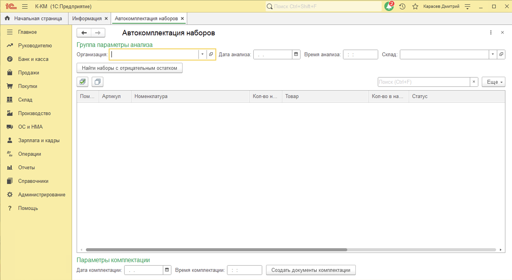
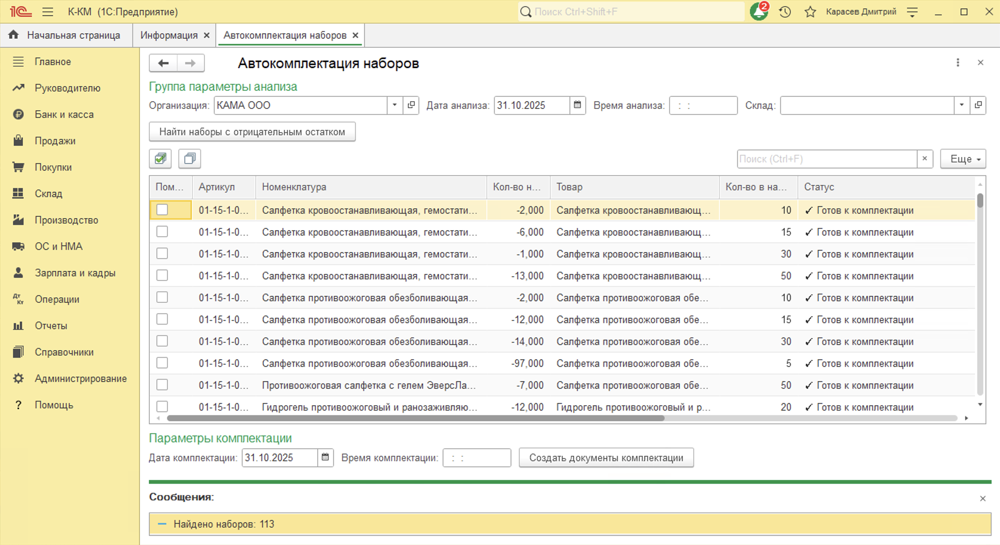
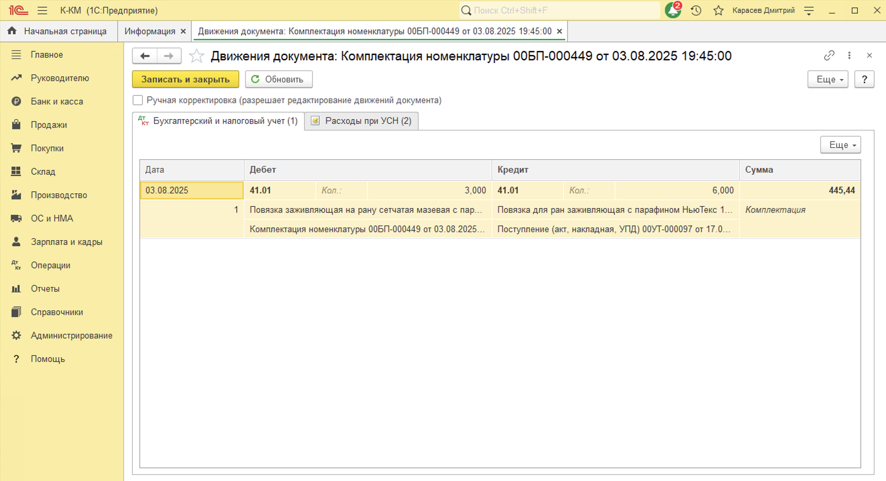
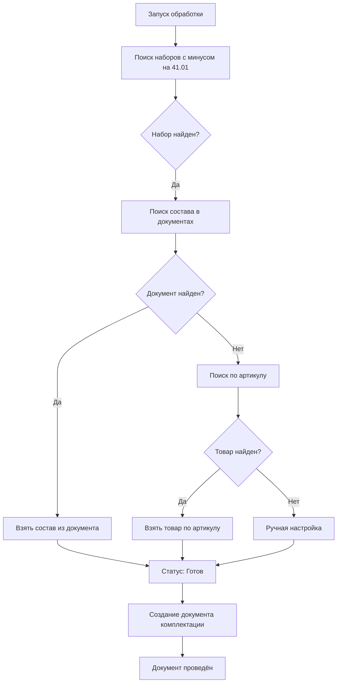

# 🔧 Автокомплектация наборов для 1С:Бухгалтерия

[](https://opensource.org/licenses/MIT)
[](https://v8.1c.ru/)
[](https://its.1c.ru/)

> Внешняя обработка для автоматического поиска и исправления отрицательных остатков наборов на счёте 41.01

## 📋 Описание

**Автокомплектация наборов** — это внешняя обработка (.epf) для 1С:Бухгалтерия предприятия 3.0, которая автоматизирует процесс комплектации наборов товаров при возникновении отрицательных остатков.

### Проблема

При продаже наборов товаров через документы реализации часто возникают отрицательные остатки на счёте 41.01, если наборы не были предварительно скомплектованы. Ручное создание документов комплектации для каждого набора — трудоёмкий процесс.

### Решение

Обработка автоматически:
- 🔍 Находит все наборы с отрицательными остатками
- 🧩 Определяет состав набора (из документов или по артикулу)
- 📝 Создаёт документы "Комплектация номенклатуры"
- ⚡ Массово обрабатывает сотни наборов за минуты

## ✨ Возможности

- ✅ **Автоматический поиск** наборов с отрицательными остатками на счёте 41.01
- ✅ **Интеллектуальное определение состава** набора из документов комплектации
- ✅ **Поиск по артикулу** как запасной вариант (формат: `базовый_артикул/количество`)
- ✅ **Ручная настройка** состава для новых наборов
- ✅ **Массовое создание** документов комплектации одной кнопкой
- ✅ **Гибкая настройка** даты и времени проведения документов
- ✅ **Удобный интерфейс** с кнопками массового выделения

## 🖼️ Скриншоты

<details>
<summary>Главная форма обработки</summary>



</details>

<details>
<summary>Результаты поиска наборов</summary>



</details>

<details>
<summary>Созданные документы</summary>



</details>

## 🚀 Быстрый старт

### Требования

- 1С:Предприятие 8.3 (любая версия)
- 1С:Бухгалтерия предприятия 3.0
- Права на создание документов "Комплектация номенклатуры"

### Установка

1. **Скачайте файл обработки:**
```
   src/АвтокомплектацияНаборовБП.epf
```

2. **Откройте в 1С:**
   - `Файл` → `Открыть`
   - Выберите файл `.epf`
   - Подтвердите открытие внешней обработки

3. **Готово!** Можно работать.

Подробная инструкция: [INSTALLATION.md](docs/INSTALLATION.md)

## 📖 Использование

### Базовый сценарий

1. **Заполните параметры:**
   - Организация (обязательно)
   - Дата и время анализа (по умолчанию: текущая дата, 21:00)

2. **Найдите наборы:**
   - Нажмите кнопку "Найти наборы с отрицательным остатком"

3. **Проверьте статусы:**
   - ✓ Готов — можно создавать документ
   - ⚠ Товар не найден — требуется ручная настройка

4. **Выделите нужные наборы:**
   - Кнопка [✓] — выделить все готовые
   - Или вручную установите галочки

5. **Создайте документы:**
   - Нажмите "Создать документы комплектации"
   - Подтвердите действие

### Ручная настройка набора

Если статус набора "⚠ Товар не найден":
- Кликните в колонку "Товар"
- Выберите нужный товар из справочника
- При необходимости измените количество

Подробная инструкция: [USER_GUIDE.md](docs/USER_GUIDE.md)

## 🔧 Как это работает

### Алгоритм поиска наборов


### Источники данных о составе

1. **Документы комплектации** (приоритет 1)
   - Ищет последний проведённый документ для этого набора
   - Берёт состав из табличной части "Комплектующие"

2. **Артикул набора** (приоритет 2)
   - Парсит артикул формата `базовый_артикул/количество`
   - Ищет товар с базовым артикулом в справочнике

3. **Ручная настройка** (приоритет 3)
   - Пользователь указывает товар и количество вручную
   - После создания документа данные сохраняются в БП

**Подробную архитектуру и все алгоритмы см. в [ARCHITECTURE.md](docs/ARCHITECTURE.md)**

## ⚙️ Настройки

### Параметры поиска

- **Организация** — для какой организации искать наборы (обязательно)
- **Склад** — ограничить поиск конкретным складом (опционально)
- **Дата анализа** — на какую дату смотреть остатки
- **Время анализа** — время среза остатков (по умолчанию 21:00)

### Параметры комплектации

- **Дата комплектации** — дата проведения документов
- **Время комплектации** — время проведения (по умолчанию на 2 часа раньше времени анализа)

### Автоматическая настройка

- Если не указан склад — используется "Основной склад"
- Дата/время заполняются автоматически при открытии
- При изменении времени анализа — автоматически пересчитывается время комплектации

## 📊 Статусы наборов

| Статус | Описание | Действие |
|--------|----------|----------|
| ✓ Готов (из документа) | Состав найден в документах комплектации | Можно создавать документ |
| ✓ Готов (по артикулу) | Товар найден по артикулу | Можно создавать документ |
| ✓ Готов (настроен вручную) | Состав настроен пользователем | Можно создавать документ |
| ⚠ Единичный товар не найден | Не удалось определить состав автоматически | Требуется ручная настройка |
| ✗ Неверный артикул | Артикул не соответствует формату | Исправить артикул набора |
| ✓ Документ создан | Документ успешно создан и проведён | Завершено |

## 🛠️ Разработка

### Технологии

- Платформа: 1С:Предприятие 8.3
- Язык: 1С:Встроенный язык
- Конфигурация: 1С:Бухгалтерия предприятия 3.0
- Тип: Внешняя обработка (.epf)

### Структура кода
```
Модуль формы:
├── ПриСозданииНаСервере()              # Инициализация
├── НайтиНаборы()                        # Поиск наборов
├── НайтиНаборыНаСервере()              # Запрос к БД
├── НайтиЕдиничныйТоварИзСостава()      # Поиск состава
├── СоздатьДокументы()                   # Создание документов
├── СоздатьДокументыНаСервере()         # Массовое создание
├── СоздатьДокументКомплектации()       # Создание одного документа
├── ВыделитьВсе()                        # UI: выделить все
├── СнятьВыделение()                     # UI: снять выделение
└── НастроитьНабор()                     # UI: ручная настройка
```

### Сборка

Обработка не требует сборки — используйте файл `.epf` напрямую.

Для модификации:
1. Откройте в Конфигураторе 1С
2. Внесите изменения
3. Выгрузите в файл `.epf`

## 🤝 Вклад в проект

Буду рад любому вкладу в проект!

### Как помочь

- 🐛 **Сообщить об ошибке** — создайте [Issue](../../issues)
- 💡 **Предложить улучшение** — создайте [Issue](../../issues) с меткой `enhancement`
- 🔧 **Исправить ошибку** — создайте Pull Request
- 📖 **Улучшить документацию** — создайте Pull Request
- ⭐ **Поставить звезду** — это мотивирует!

### Правила

1. Форкните репозиторий
2. Создайте ветку для своих изменений (`git checkout -b feature/amazing-feature`)
3. Зафиксируйте изменения (`git commit -m 'Add amazing feature'`)
4. Отправьте в ветку (`git push origin feature/amazing-feature`)
5. Создайте Pull Request

## 📝 История изменений

См. [CHANGELOG.md](CHANGELOG.md) для списка изменений.

## 📄 Лицензия

Распространяется под лицензией MIT. См. [LICENSE](LICENSE) для подробностей.

## 👤 Автор

- GitHub: [@dskarasev/](https://github.com/dskarasev/)

## 🙏 Благодарности

- Команде 1С за платформу
- Сообществу 1С разработчиков
- Всем, кто тестировал и давал обратную связь

## ❓ FAQ

**Q: Обработка нашла 0 наборов, но минусы есть**

A: Проверьте правильность выбора организации и даты анализа. Убедитесь, что в артикуле набора есть символ "/" (например: `01-15-1-0110/15`).

**Q: Можно ли использовать в других конфигурациях?**

A: Обработка разработана для 1С:БП 3.0, но может работать в других конфигурациях на платформе 8.3 при наличии документа "Комплектация номенклатуры".

**Q: Как часто нужно запускать обработку?**

A: По мере необходимости — обычно после массовых продаж наборов или перед закрытием периода.

Больше вопросов в [FAQ.md](docs/FAQ.md)

## 🔗 Полезные ссылки

- [Документация 1С:Бухгалтерия](https://its.1c.ru/db/bp3)
- [Форум 1С](https://forum.infostart.ru/)
- [Техническая поддержка](https://github.com/yourusername/1c-auto-kit-assembly/issues)

---

⭐ Если проект оказался полезным — поставьте звезду!
```

---

## 5️⃣ LICENSE (MIT License)
```
MIT License

Copyright (c) 2025 Dmitry (MobiGir LLC)

Permission is hereby granted, free of charge, to any person obtaining a copy
of this software and associated documentation files (the "Software"), to deal
in the Software without restriction, including without limitation the rights
to use, copy, modify, merge, publish, distribute, sublicense, and/or sell
copies of the Software, and to permit persons to whom the Software is
furnished to do so, subject to the following conditions:

The above copyright notice and this permission notice shall be included in all
copies or substantial portions of the Software.

THE SOFTWARE IS PROVIDED "AS IS", WITHOUT WARRANTY OF ANY KIND, EXPRESS OR
IMPLIED, INCLUDING BUT NOT LIMITED TO THE WARRANTIES OF MERCHANTABILITY,
FITNESS FOR A PARTICULAR PURPOSE AND NONINFRINGEMENT. IN NO EVENT SHALL THE
AUTHORS OR COPYRIGHT HOLDERS BE LIABLE FOR ANY CLAIM, DAMAGES OR OTHER
LIABILITY, WHETHER IN AN ACTION OF CONTRACT, TORT OR OTHERWISE, ARISING FROM,
OUT OF OR IN CONNECTION WITH THE SOFTWARE OR THE USE OR OTHER DEALINGS IN THE
SOFTWARE.
