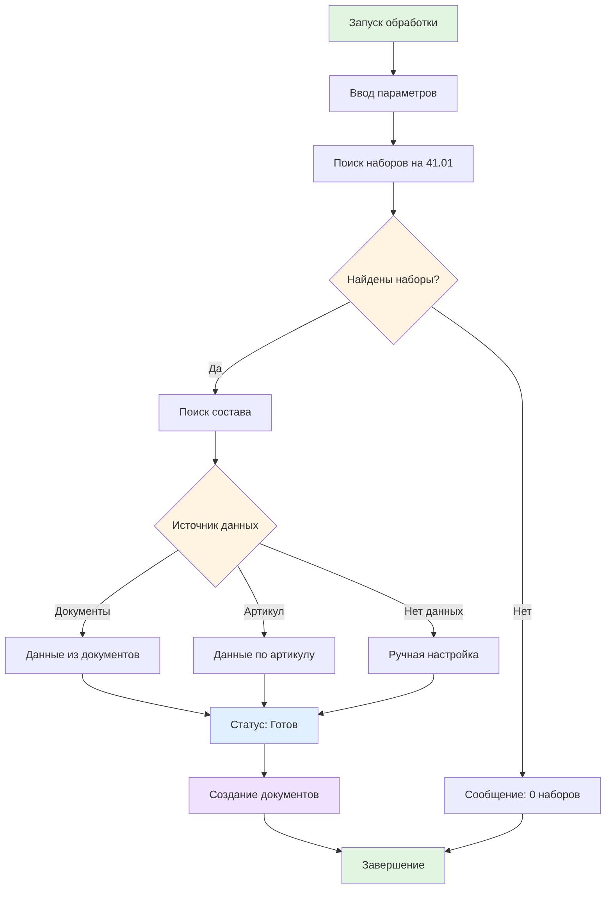
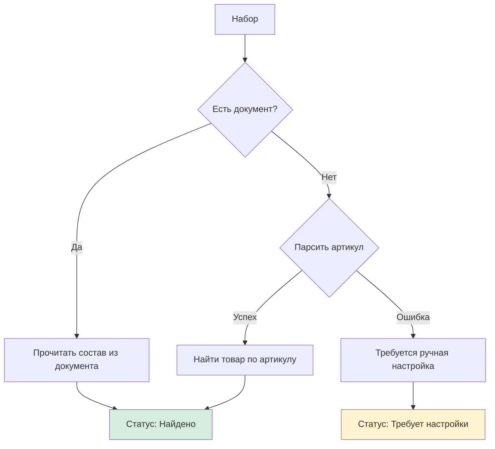
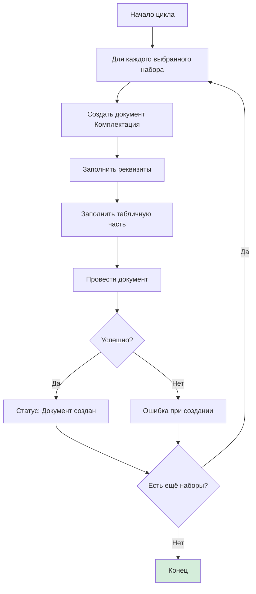

# 🏗️ Архитектура и алгоритмы

Этот документ описывает технические детали работы обработки "Автокомплектация наборов".

## 🔄 Основной алгоритм

### Блок-схема процесса



## 📊 Фазы работы

### Фаза 1: Поиск наборов (Search Phase)

**Входные данные:**
- Организация
- Дата анализа
- Время анализа
- Склад (опционально)

**Процесс:**
1. Выполняется запрос к таблице остатков на счёте 41.01
2. Фильтруются остатки для выбранной организации
3. Ищутся остатки меньше нуля (отрицательные)
4. Из таблицы берутся только наборы (по типу номенклатуры)

**Выходные данные:**
- Список найденных наборов с отрицательными остатками

### Фаза 2: Определение состава (Composition Phase)

**Входные данные:**
- Набор номенклатуры
- Его артикул
- Дата анализа

**Процесс поиска:**



**Приоритеты источников:**

1. **Документ комплектации** (Приоритет 1)
   - Ищет последний проведённый документ "Комплектация номенклатуры"
   - Фильтр: тип документа = "Комплектация номенклатуры"
   - Фильтр: набор = текущий набор
   - Берёт состав из табличной части "Комплектующие"
   - Берёт одну строку (обычно один товар в одном количестве)

2. **Парсинг артикула** (Приоритет 2)
   - Артикул должен быть в формате: `АРТИКУЛ/КОЛ-ВО`
   - Пример: `01-15-1/15` → артикул=`01-15-1`, кол-во=`15`
   - Ищет товар с таким артикулом
   - Если товар найден → используется как состав

3. **Ручная настройка** (Приоритет 3)
   - Требует вмешательства пользователя
   - Пользователь вручную выбирает товар и количество

### Фаза 3: Создание документов (Document Creation Phase)

**Входные данные:**
- Список наборов со статусом "Готов"
- Дата комплектации
- Время комплектации

**Процесс:**



**Наполнение документа:**

Реквизиты документа:
- **Организация** — выбранная пользователем
- **Дата проведения** — дата комплектации
- **Время проведения** — время комплектации
- **Набор** — обрабатываемый набор
- **Склад** — основной (или выбранный)

Табличная часть "Комплектующие":
- **Товар** — найденный товар из состава
- **Количество** — из состава (или из артикула)
- **Единица измерения** — берётся из товара

## 🔍 Детали реализации

### Поиск наборов на счёте 41.01

**SQL запрос (логика):**
```sql
SELECT 
    Набор,
    СУММА(Остаток) AS ОстатокНеумов
FROM Остатки.41.01
WHERE 
    Организация = @Организация
    AND Остаток < 0
    AND ТипНоменклатуры = 'Набор'
    AND Дата <= @ДатаАнализа
GROUP BY Набор
```

### Парсинг артикула

**Алгоритм:**
1. Берём артикул набора
2. Ищем последний символ "/"
3. Если "/" есть:
   - До "/" → базовый артикул
   - После "/" → количество (конвертируем в число)
4. Если "/" нет → ошибка парсинга

**Примеры:**
```
"01-15-1/15" → артикул="01-15-1", кол-во=15 ✓
"ABC-123/5" → артикул="ABC-123", кол-во=5 ✓
"НАБОР-001" → ошибка парсинга ✗
"10/20/30" → артикул="10/20", кол-во=30 ✓
```

### Поиск документа комплектации

**Параметры поиска:**
- Тип документа = "Комплектация номенклатуры"
- Статус = "Проведён"
- Реквизит "Набор" = текущий набор
- Дата <= дата анализа
- Сортировка по дате убыванию (берём последний)

### Создание документа

**Проверки перед созданием:**
- ✓ Товар существует в справочнике
- ✓ Количество > 0
- ✓ Дата комплектации <= дата анализа
- ✓ Права на создание документа

**Исключения и ошибки:**
- Если товар удалён → ошибка
- Если дата неверная → ошибка
- Если нет прав → ошибка создания
- Если документ не проводится → ошибка

## 📈 Производительность

### Оптимизация запросов

- **Индексы используются:** счёт 41.01 + организация + дата
- **Кэширование:** результаты поиска кэшируются в памяти обработки
- **Оптимизация цикла:** массовое создание документов по одному

### Ограничения

- Максимум найденных наборов: зависит от памяти 1С
- Рекомендуется: до 500 наборов за раз
- Для 1000+ наборов: разбить на несколько запусков

### Скорость

Типичные времена выполнения:
- Поиск 100 наборов: 1-2 секунды
- Определение состава 100 наборов: 2-3 секунды
- Создание 100 документов: 10-30 секунд

## 🔐 Безопасность

### Что проверяется

- ✓ Права на чтение справочников
- ✓ Права на создание документов
- ✓ Корректность выбранной организации
- ✓ Существование товаров перед созданием

### Что НЕ проверяется

- Количество товара на складе (допускаются отрицательные остатки)
- Дублирование документов (можно создать несколько одинаковых)
- Историю цен (документ создаётся с текущими ценами)

## 📚 Источники данных

### Справочники, которые используются

1. **Номенклатура**
   - Для поиска товаров по артикулу
   - Для определения типа (Набор или Товар)

2. **Организация**
   - Для фильтрации остатков
   - Для заполнения документов

3. **Складские места/Склады**
   - Для определения основного склада
   - Для фильтрации остатков

### Документы, которые используются

1. **Реализация**
   - Создаёт отрицательные остатки

2. **Комплектация номенклатуры**
   - Ищется последний документ для определения состава
   - Создаёт новые документы для исправления минусов

3. **Остатки по счётам**
   - Используется для поиска наборов с минусами

---

**Последнее обновление:** 2025-01-15
