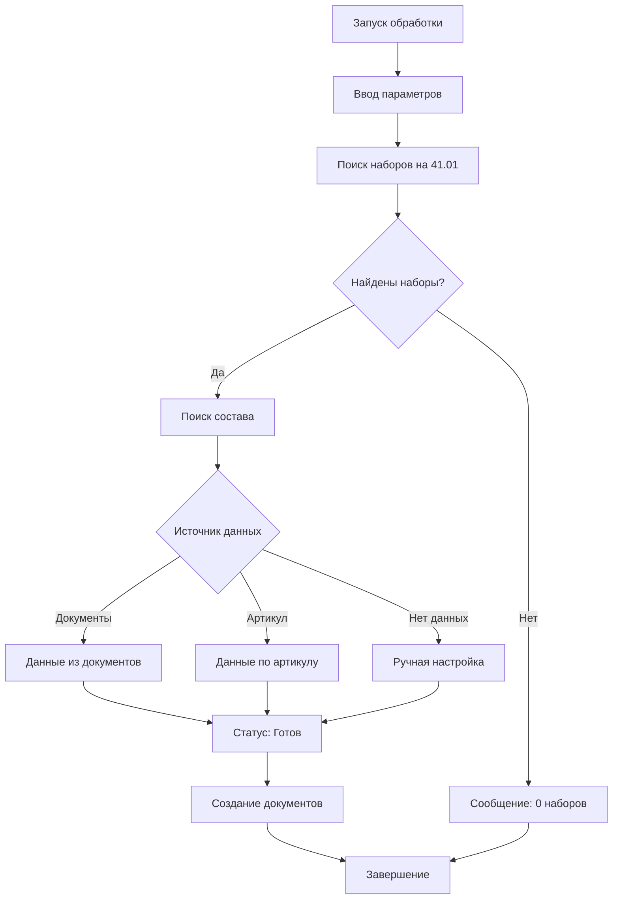

# 📖 Руководство пользователя

Подробное руководство по использованию внешней обработки "Автокомплектация наборов".

## 🎯 Основные возможности

- 🔍 **Автоматический поиск** наборов с отрицательными остатками на счёте 41.01
- 🧩 **Интеллектуальное определение состава** из предыдущих документов
- 📝 **Массовое создание** документов "Комплектация номенклатуры"
- ⚡ **Быстрая обработка** сотен наборов за минуты
- 🔧 **Ручная настройка** для новых или сложных наборов
- 🛠️ **Гибкие параметры** даты и времени комплектации

## 🚀 Быстрый старт

### Шаг 1: Откройте обработку
```
Файл → Открыть → АвтокомплектацияНаборовБП.epf
```

### Шаг 2: Выберите параметры
- **Организация** (обязательно)
- **Дата анализа** (по умолчанию текущая дата)
- **Время анализа** (по умолчанию 21:00)

### Шаг 3: Найдите наборы
Нажмите кнопку **"Найти наборы с отрицательным остатком"**

### Шаг 4: Проверьте результаты
- Каждый набор имеет статус
- ✓ Готов — можно создавать
- ⚠ Товар не найден — требуется настройка

### Шаг 5: Выделите нужные наборы
- Нажмите **[✓ Выделить все готовые]** 
- Или выделите вручную

### Шаг 6: Создайте документы
Нажмите **"Создать документы комплектации"**

## 📋 Подробное описание

### Параметры поиска

#### Организация (Обязательно)
- Выберите организацию для анализа
- Можно обрабатывать несколько организаций по очереди
- Документы будут созданы для выбранной организации

#### Дата анализа
- По какую дату смотреть остатки
- По умолчанию: текущая дата
- Влияет на расчёт остатков на счёте 41.01

#### Время анализа
- На какой момент времени проверять остатки
- По умолчанию: 21:00 (конец рабочего дня)

#### Склад (Опционально)
- Ограничить поиск конкретным складом
- Если не указан — используется "Основной склад"
- Оставьте пустым для поиска по всем складам

### Параметры комплектации

#### Дата комплектации
- На какую дату проводить создаваемые документы
- По умолчанию: = дате анализа

#### Время комплектации
- На какой момент проводить документы
- По умолчанию: время анализа минус 2 часа
- По умолчанию: = 19:00

### Таблица результатов

#### Колонки

| Колонка | Описание |
|---------|----------|
| **Набор** | Номер или наименование набора |
| **Статус** | Статус определения состава набора |
| **Товар** | Товар, который должен быть в составе |
| **Кол-во** | Количество товара в составе |
| **Выбрать** | Флаг для выбора при создании документов |

#### Статусы

- **✓ Готов (из документа)** — состав найден в предыдущих документах комплектации
- **✓ Готов (по артикулу)** — товар определён по артикулу набора
- **✓ Готов (настроен вручную)** — состав был отредактирован пользователем
- **⚠ Товар не найден** — не удалось автоматически определить товар
- **✗ Неверный артикул** — артикул не соответствует формату

## 🛠️ Ручная настройка

1. **Кликните в колонку "Товар"** для набора со статусом "⚠"
2. **Нажмите Ctrl+E** (или кнопку редактирования) 
3. **Выберите товар** из справочника
4. **Измените количество** если необходимо
5. **Нажмите Enter** для сохранения
6. **Статус изменится** на "✓ Готов (настроен вручную)"

## 📊 Примеры использования

### Пример 1: Простая обработка

**Сценарий:** В конце месяца нужно исправить отрицательные остатки для 50 наборов.

**Шаги:**
1. Откройте обработку
2. Выберите организацию "ООО Магазин"
3. Установите дату на последний день месяца
4. Нажмите "Найти наборы" → найдено 50 наборов
5. Нажмите [✓ Выделить все готовые] → выделено 48
6. Для 2 наборов со статусом "⚠" проведите ручную настройку
7. Нажмите "Создать документы" → создано 50 документов

**Результат:** Все отрицательные остатки исправлены за 5 минут.

### Пример 2: Сложная обработка с новыми наборами

**Сценарий:** Появились новые наборы без предыдущих документов комплектации.

**Шаги:**
1. Запустите поиск
2. Видите 30 наборов, из них:
   - 20 статус "✓ Готов (из документа)"
   - 10 статус "⚠ Товар не найден" (новые наборы)
3. Выделите готовые 20 и создайте документы
4. Для 10 новых:
   - Нажмите на каждый и отредактируйте
5. После настройки всех 10 создайте их документы

## ⚙️ Как работает определение состава

### Приоритет источников

```
1. Поиск в документах комплектации
   ↓ (если не найдено)
2. Поиск по артикулу набора
   ↓ (если не найдено)
3. Ручная настройка пользователем
```

### Поиск в документах (Приоритет 1)

**Как работает:**
- Ищет последний проведённый документ "Комплектация номенклатуры"
- Для этого конкретного набора
- Берёт состав из табличной части "Комплектующие"

**Формат артикула:** Не имеет значения

**Пример:**
```
Набор: 01-15-1-0110/15 или НАБОР-001
↓
Поиск документов где набор = "01-15-1-0110/15"
↓
Найден документ от 10.01.2025: Товар "Сок апельсиновый" Кол-во: 15
↓
Статус: ✓ Готов (из документа)
```

### Поиск по артикулу (Приоритет 2)

**Как работает:**
- Парсит артикул набора по формату: `базовый_артикул/количество`
- Ищет товар с базовым артикулом в справочнике "Номенклатура"

**Формат артикула:** `АРТИКУЛ/КОЛ-ВО`

**Примеры:**
```
Артикул набора: 01-15-1/15
↓ Парсинг
Базовый артикул: 01-15-1
Количество: 15
↓ Поиск
Ищет товар с артикулом "01-15-1"
↓ Результат
Найден товар "Сок апельсиновый" артикул "01-15-1"
Статус: ✓ Готов (по артикулу)
```

**Ошибки при парсинге:**
```
Артикул: "НАБОР-001" (нет /)
↓
Статус: ✗ Неверный артикул
Действие: Установите артикул в формате "АРТИКУЛ/КОЛ-ВО"
```

## 📞 Часто задаваемые вопросы

**Q: Почему не находятся наборы?**

A:
- Проверьте организацию (должна быть та же, что в документах)
- Убедитесь, что дата анализа корректна
- Проверьте, что на счёте 41.01 есть минусовые остатки
- Наборы должны быть типа "Набор" в справочнике

**Q: Как изменить формат артикула?**

A: Обработка работает с артиклами формата `АРТИКУЛ/КОЛ-ВО`. Если ваш формат другой, используйте ручную настройку.

**Q: Можно ли обработать несколько организаций?**

A: Да, обработайте их по очереди:
1. Выберите первую организацию → найдите → создайте
2. Выберите вторую организацию → найдите → создайте

**Q: Где смотреть созданные документы?**

A: 
- Меню: `Документы` → `Комплектация номенклатуры`
- Или через поиск по реквизитам

**Q: Документ создался с ошибкой?**

A: Проверьте:
- Права доступа на создание документов
- Корректность даты комплектации (должна быть раньше даты анализа)
- Существует ли указанный товар в справочнике
- Открыте консоль браузера (F12) и посмотрите ошибку

## 🔐 Безопасность и права доступа

**Требуемые права:**
- ✓ Чтение справочника "Номенклатура"
- ✓ Чтение справочника "Контрагенты"
- ✓ Чтение справочника "Склады"
- ✓ Чтение документа "Комплектация номенклатуры"
- ✓ Создание документа "Комплектация номенклатуры"

**Если прав нет:**
- Обратитесь к администратору БД
- Попросите выдать нужные права для вашего пользователя

---

**Дата последнего обновления:** 2025-01-15

## 🔧 Как работает обработка

### Основной алгоритм



Подробное описание архитектуры см. в [ARCHITECTURE.md](ARCHITECTURE.md)
